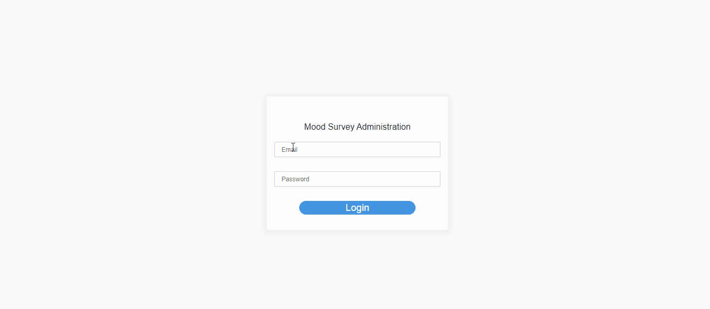

# Mood Survey

Mood Survey is a web application that developed to collect data from employees about the daily moods.


### About The Project



I wanted to develop a React application without using any state management tools like Redux or MobX.
The project involves two main pages: administration and survey pages.
Authentication implemented using Firebase. After logged in, the admin user can upload a CSV file to share the survey. 
With Nodemailer and Mailgun integration, the survey is distributed to end-users by e-mail with a unique URL. 
After an end-user fills out the survey, the data is saved to the Firebase.

### Tech
* ReactJS
* Node.js
* Express
* Nodemailer
* Firebase
### Installation

1. Get API Keys at [https://firebase.google.com](https://firebase.google.com/)
2. Clone the repo
```sh
git clone https://github.com/aysenuralbayrak/mood-survey.git
```
3. Install NPM packages
```sh
npm install
```
4. Enter your API keys in `local.env` files of frontend and backend.
```JS
const API_KEY = 'ENTER YOUR API';
```
5. Run
```
npm run dev
```
